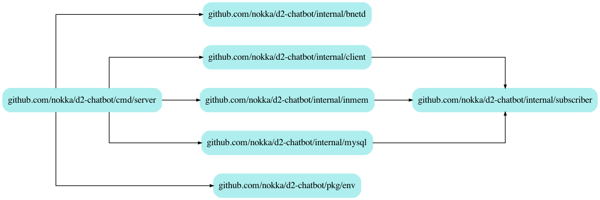

# D2-Chatbot
D2 Chatbot provides a global chat for any Diablo 2 server running on PvpGN and provides in game community chat channels.

--- 

# Environment variables
| Name           	| Default        	| Description                                                            	|
|----------------	|----------------	|------------------------------------------------------------------------	|
| SERVER_ADDRESS 	|                	| Address to the Diablo II server                                        	|
| MYSQL_HOST     	| 127.0.0.1:3306 	| Database URL                                                           	|
| MYSQL_USER     	| chat_user      	| Database user used to perform operations on the database               	|
| MYSQL_PASSWORD 	|                	|                                                                        	|
| CHAT_USERNAME  	| chat           	| Bot account for the chat bot (needs to exist on the Diablo II server)  	|
| TRADE_USERNAME 	| trade          	| Bot account for the trade bot (needs to exist on the Diablo II server) 	|
| HC_USERNAME    	| hc             	| Bot account for the hc bot (needs to exist on the Diablo II server)    	|
| CHAT_PASSWORD  	|                	|                                                                        	|
| TRADE_PASSWORD 	|                	|                                                                        	|
| HC_PASSWORD    	|                	|                                                                        	|
| BNETD_LOG      	|                	| Path on disk to the bnetd.log used to parse states of account          	|

--- 

## Available channels
This package was built specifically to run on the Diablo II private server [Slashdiablo](https://slashdiablo.net) and the
available channels that are used there.

### Chat
This is the primary chat channel used for everyone, but mainly used by Softcore players on Slashdiablo.

### HC
This is the primary channel for Hardcore players.

### Trade
This channel is used to trade mostly on Softcore.

---

## In game commands
The in game commands are used by players to use the global chat, they can subscribe, unsubscribe and chat.
There are also commands used only by moderators to ban players.

### Subscribe to a channel

```bash
# Subscribe to chat
//sub chat

# Subscribe to trade
//sub trade

# Subscribe to hc
//sub hc
```

#### Example

### Subscribe to a channel

```bash
# Subscribe to chat
//unnsub chat

# Subscribe to trade
//unsub trade

# Subscribe to hc
//unsub hc
```

#### Example

### Chat on channel

```bash
# Chat on chat channel
//chat Hello!

# Chat on hc channel
//hc Hello!

# Chat on the trade channel
//trade Hello!
```

---

## Package dependency graph


### How to generate the graph
[godephgraph](https://github.com/kisielk/godepgraph) is used to generate the dependency graph.

```bash
$ godepgraph -nostdlib -novendor -horizontal -onlyprefixes=github.com/nokka/d2-chatbot github.com/nokka/d2-chatbot/cmd/server | dot -Tpng -o docs/deps.png
```
---
